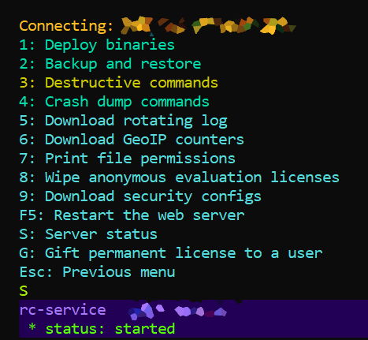

# Vrmac.Admin

This DLL implements some infrastructure to remotely manage Linux servers.

The library is designed in the assumption the user of the tool is a human, not another tool.

I have only tested with Alpine Linux remote servers, because that’s my only use case.
Still, the library should be compatible with any remote system accessible with SSH protocol authenticated with public keys.

The remoting pieces are linked from the [SSH.NET](https://www.nuget.org/packages/SSH.NET) dependent package.

## Console I/O

The `Vrmac.Admin.Print` static class contains utility functions which print coloured messages to the console.

Similarly, `Vrmac.Admin.Input` static class contains higher-level utility functions for console input.

## Networking

For optimal usability, I have wrote extension methods for `SshClient` and `ScpClient` classes implementing slightly higher level operations.
See `Vrmac.Admin.SSH` and `Vrmac.Admin.SCP` static classes in this library.

For instance, `SSH.command` executes a remote command forwarding standard output and error streams to console,
and translates non-zero status codes into .NET exceptions.

## Menu System

The `MenuRunner` class is perhaps the most important piece of the infrastructure in this library.
It implements a hierarchy of CLI menus.

Specifically, it uses reflection to enumerate non-static methods of the generic type argument,
and generates menu items from the methods decorated with `[Command]` custom attribute.

Here’s a redacted screenshot of a non-trivial menu implemented with this library.



The class implementing that menu, redacted slightly.
This library doesn’t require a specific base class for these menus.

```cs
/// <summary>Root commands available in production mode</summary>
sealed partial class MenuRootProd: RootSession
{
	[Command( "Deploy binaries" ), CommandColour( Colours.submenu )]
	public Task menuDeploy() => MenuRunner.runMenu( new MenuRootDeploy( this ) );

	[Command( "Backup and restore" ), CommandColour( Colours.submenu )]
	public Task menuBackup() => MenuRunner.runMenu( new MenuRootBackup( this ) );

	[Command( "Destructive commands" ), CommandColour( Colours.danger )]
	public Task menuDestructive()
	{
		Print.warning( "Entering a menu with the commands which destroy critically important data on the server." );
		Print.prompt( "Type yes to confirm, anything else to cancel." );
		string? str = Input.readLine()?.ToLowerInvariant();
		if( "yes" != str )
			return Task.CompletedTask;
		return MenuRunner.runMenu( new MenuRootDestructive( this ) );
	}

	[Command( "Crash dump commands" ), CommandColour( Colours.submenu )]
	public Task menuCrashDumpsRemote() => MenuRunner.runMenu( new MenuCrashDumpsRemote( this ) );

	[Command( "Download rotating log" )]
	public async Task downloadLog()
	{
		// Download new snapshot from the remote
		var scp = await files();
		await ssh.command( "/usr/***" );
		// The server truncates the log automatically so it stays under ***, and they compress really well
		byte[] gzipBytes = scp.downloadBytes( "***" );
		await ssh.command( "rm ***" );

		// Apply these templates converting binary to HTML
		string path = Path.Combine( Program.folder, "logs" );
		Directory.CreateDirectory( path );
		string now = DateTime.UtcNow.ToString( "yyyy'-'MM'-'dd'T'HH'-'mm'-'ss'Z'" );
		path = Path.Combine( path, $"log-{now}.html" );
		Html.ParsedLog.parse( path, gzipBytes, now );

		// Open the HTML in a browser
		ProcessStartInfo psi = new( path )
		{
			UseShellExecute = true
		};
		using var p = Process.Start( psi );
	}

	[Command( "Download GeoIP counters" )]
	public async Task downloadGeoIpCounters()
	{
		const string name = VrmacServer.GeoIpLog.GeoIpUtils.fileName;
		string path = Path.Combine( Program.folder, name );
		path = Path.ChangeExtension( path, ".tsv" );
		if( File.Exists( path ) )
			File.Delete( path );

		// Download the binary file into memory; it's *** bytes.
		// The server replaces the file at most once per minute with atomic moves.
		ScpClient scp = await files();
		byte[] bytes = scp.downloadBytes( "***" + name );
		ReadOnlySpan<long> counters = MemoryMarshal.Cast<byte, long>( bytes );

		// Produce the TSV table
		GeoCounters.writeTable( path, counters );
		Print.info( "Saved GeoIP counters: " + path );

		// Open in Excel
		ProcessStartInfo psi = new( path )
		{
			UseShellExecute = true,
			Verb = "Open"
		};
		using Process? excel = Process.Start( psi );
	}

	[Command( ConsoleKey.F5, "Restart the web server" )]
	public Task restartServer() => ssh.command( "rc-service *** restart" );

	[Command( 's', "Server status" )]
	public Task status() => ssh.command( "rc-service *** status" );

	[Command( "Wipe anonymous evaluation licenses" )]
	public Task deleteAnonEvals()
	{
		string cmd = @"mariadb ***";
		return ssh.command( cmd );
	}

	[Command( 'g', "Gift permanent license to a user" )]
	public async Task giftLicense()
	{
		Print.prompt( "Account e-mail:" );
		string? str = Input.readLine() ?? throw new OperationCanceledException();
		string mail = validateMail( str );

		Print.prompt( "Licence count:" );
		str = Input.readLine() ?? throw new OperationCanceledException();
		int count = int.Parse( str );

		await DbInit.giftPermanent( ssh, mail, count );

		static string validateMail( string? mail )
		{
			if( string.IsNullOrWhiteSpace( mail ) )
				throw new ArgumentException( "Email address is required" );
			if( !MailAddress.TryCreate( mail, out MailAddress? addr ) )
				throw new ArgumentException( "Invalid email address format" );
			string result = addr.Address;
			if( result.Length > 254 )
				throw new ArgumentException( "Email address is too long" );
			return result;
		}
	}

	internal static async Task<MenuRootProd> connect()
	{
		(SshClient ssh, ConnectionCreds creds) = await connect( eSshAccount.root );
		return new MenuRootProd( ssh, creds );
	}
	MenuRootProd( SshClient ssh, ConnectionCreds creds ) : base( ssh, creds ) { }
}
```